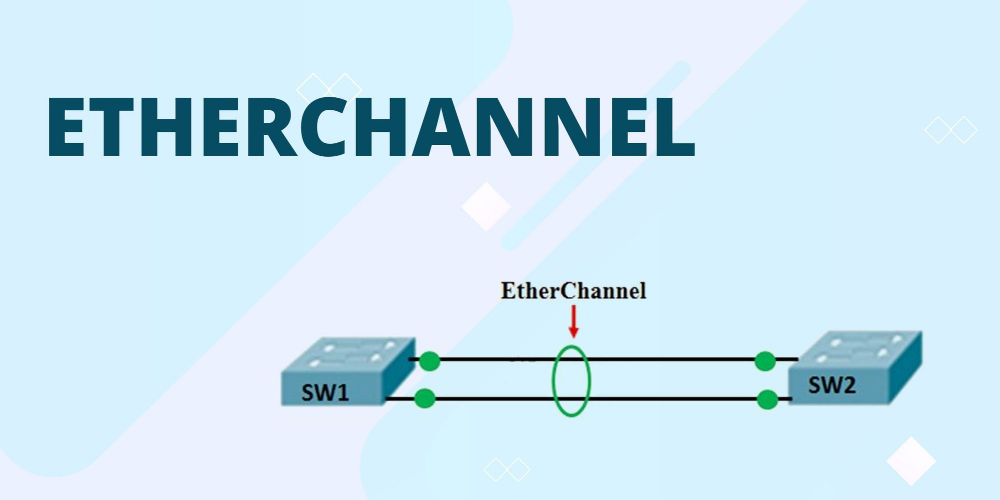

# 🏰️ **Etherchannel & Haute Disponibilité**

[](https://www.cisco.com/) [](https://www.cisco.com/c/en/us/support/docs/lan-switching/etherchannel/index.html) [](https://www.cisco.com/c/en/us/support/docs/ip/hot-standby-router-protocol-hsrp/index.html)



---

## 📄 **Description**

Ce dépôt fournit un ensemble de configurations, de scripts et de guides dédiés à la mise en œuvre d’**EtherChannel** sur des commutateurs et du protocole **HSRP** sur des routeurs afin d’améliorer la **haute disponibilité** et la **résilience** du réseau. Vous y trouverez des exemples concrets illustrant les scénarios de basculement, des modèles de configuration prêts à l’emploi ainsi que des bonnes pratiques pour renforcer la fiabilité de votre infrastructure réseau.

---

## 💂 **Contenu du Dépôt**

- **`doc/`** : Documentation détaillée des configurations, scénarios de test et bonnes pratiques.
- **`img/`** : Images, schémas et bannières d’illustration.
- **`pka/`** : Fichiers Packet Tracer (.pka) pour reproduire et tester les configurations sur des environnements simulés.
- **`pka-sd-wan/`** : Configurations et topologies orientées SD-WAN, incluant EtherChannel et HSRP.
- **`LICENSE`** : Licence du projet.
- **`README.md`** : Guide détaillé du dépôt.

---

## ⚙️ **Prérequis**

- Connaissances de base en configuration de commutateurs et routeurs Cisco.
- Outils d’émulation/simulation réseau tels que **Cisco Packet Tracer**, **GNS3** ou **EVE-NG**.
- Accès à du matériel ou à un environnement virtuel Cisco si nécessaire.
- Accès administrateur sur les équipements pour appliquer les configurations.

---

## 🚀 **Mise en Œuvre**

### 1. **Cloner le dépôt**

```bash
git clone https://github.com/votre_nom_utilisateur/etherchannel-haute-disponibilite.git
cd etherchannel-haute-disponibilite
```

### 2. **Parcourir la Documentation**

Consultez le dossier `doc/` pour obtenir des instructions détaillées sur :

- La configuration d’EtherChannel (PAgP, LACP, mode statique).
- La mise en œuvre de HSRP sur des routeurs.
- Les scénarios de basculement pour tester la haute disponibilité.

### 3. **Importer les Fichiers Packet Tracer**

- Ouvrez **Cisco Packet Tracer**.
- Importez les fichiers `.pka` disponibles dans les dossiers `pka/` et `pka-sd-wan/`.
- Testez et modifiez les configurations pour vous approprier les concepts.

---

## 🔧 **Configurations Clés**

### 🌐 **EtherChannel**

- Configuration des liens agrégés (Port-Channel).
- Choix du protocole d’agrégation (PAgP, LACP, mode statique).
- Vérification de l’état du Port-Channel.

### 🚦 **HSRP**

- Configuration du groupe HSRP sur les routeurs.
- Paramétrage des adresses virtuelles.
- Tests de basculement et validation de la redondance.

---

## 👑 **Exemples de Scénarios**

- **Basculement de lien EtherChannel** : Simuler la défaillance d’un lien dans l’agrégat pour vérifier la continuité du service.
- **Test HSRP** : Mettre hors service le routeur primaire et observer la prise de relais par le routeur de secours.
- **Optimisation du Routage** : Coupler HSRP avec des protocoles de routage dynamiques pour une redondance accrue.

---

## 🛠️ **Bonnes Pratiques**

- Utiliser des versions logicielles à jour sur les équipements.
- Déployer plusieurs liens agrégés pour répartir la charge et limiter les points de défaillance uniques.
- Tester régulièrement les scénarios de basculement.
- Documenter toutes les modifications de configuration et conserver des sauvegardes.

---

## 💌 **Support & Contributions**

Pour toute question, proposition d’amélioration ou contribution :

- Créez une **issue** sur GitHub.
- Envoyez une **pull request** avec vos modifications.
- Contactez **votre_nom_utilisateur** via GitHub.

---

## 🟩 **Licence**

Ce projet est sous licence MIT. Consultez le fichier [LICENSE](LICENSE) pour plus d’informations.

---

### 🗓 **Date de Création**

Décembre 2024

